# BTCUSDT USD-M先物: レジーム識別 EDA と walk-forward

生成日時: 2026-08-17 17:20 UTC

## 結論の要約

この分析は Binance USD-M perpetual futures の BTCUSDT を対象とする探索的分析です。1時間足・日足は 2020-01-01 から 2026-08-16、15分足・Funding・Metrics は 2025-08-17 から 2026-08-16 を使用しました。全標本HMM/GMMは記述目的のみであり、売買性能の根拠には使いません。

- 全標本の選択状態数: HMM **3**、GMM **4**。HMM seed ARI は **0.999**。
- Walk-forward は **39,791 時点**、将来参照違反 **0**。状態数は初期学習窓で固定し、各月で過去データだけを再学習しました。
- 5 bps/ポジション変更の診断戦略で最高Sharpeは **buy_hold** (total return 63.01%, Sharpe 0.21, MDD -67.39%)。これは未約定・スリッページ・建玉上限を含まない研究用の比較であり、実運用の成績ではありません。
- Metrics は期待 105,120 本に対して 105,113 本です。公式ソース由来の欠損 7 区間は補間していません。Fundingは公開遅延のため 2026-07-31T16:00:00+00:00 までで、範囲全体には不足があります。
- 清算はPublic Dataに履歴アーカイブがないため、OI減少・出来高z-score・下位3%リターンによる `liquidation_proxy` を明示的な代理指標として扱います。CMEの実価格ギャップも `insufficient_data` です。

## 入力データ品質

| dataset | rows | first | last | gaps/status |
| --- | ---: | --- | --- | --- |
| 15m Kline | 35,040 | 2025-08-17T00:15:00+00:00 | 2026-08-17T00:00:00+00:00 | 0 |
| 1h Kline | 58,080 | 2020-01-01T01:00:00+00:00 | 2026-08-17T00:00:00+00:00 | 0 |
| 1d Kline | 2,420 | 2020-01-02T00:00:00+00:00 | 2026-08-17T00:00:00+00:00 | 0 |
| Funding | 1,047 | 2025-08-17T00:00:00+00:00 | 2026-07-31T16:00:00+00:00 | insufficient_data |
| Metrics | 105,113 | 2025-08-17T00:00:00+00:00 | 2026-08-16T23:55:00+00:00 | success_with_warnings |

全Klineの時刻は「足終値が利用可能になるUTC境界（close_time + 1ms）」です。ダウンロード済みアーカイブは公式CHECKSUMで検証し、正規化CSVのOHLC・時刻間隔・有限値も再検査しています。

## 分布・季節性・プライスアクション

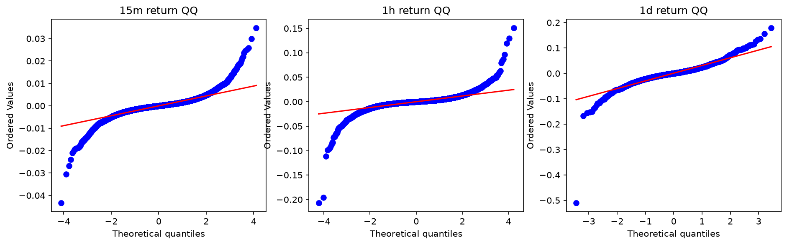

15分足/1時間足/日足の分布と極端足後の条件付き挙動です。平均値と比率の95%区間は、時系列依存を残すブロック・ブートストラップで計算しています。

| interval | event | count | continuation_rate | continuation_ci95_low | continuation_ci95_high | mean_next_return | median_next_return | mean_ci95_low | mean_ci95_high | status |
| --- | --- | --- | --- | --- | --- | --- | --- | --- | --- | --- |
| 15m | bottom_3pct | 1052 | 0.420152 | 0.393037 | 0.451069 | 0.000144569 | 0.0006056 | -8.22035e-05 | 0.000352168 | ok |
| 15m | top_3pct | 1052 | 0.41635 | 0.384933 | 0.443465 | -0.00021904 | -0.000573827 | -0.000430755 | -1.8161e-05 | ok |
| 1h | bottom_3pct | 1743 | 0.423982 | 0.402754 | 0.445841 | 0.000680938 | 0.00146922 | 0.000110427 | 0.00125759 | ok |
| 1h | top_3pct | 1743 | 0.484796 | 0.461847 | 0.507473 | 0.000485093 | -0.00024616 | 6.12201e-05 | 0.000919521 | ok |
| 1d | bottom_3pct | 73 | 0.438356 | 0.342466 | 0.52774 | 0.00906641 | 0.00342272 | -0.00376652 | 0.0160769 | ok |
| 1d | top_3pct | 73 | 0.424658 | 0.30137 | 0.541438 | -0.0056605 | -0.00856707 | -0.0132357 | 0.00345131 | ok |

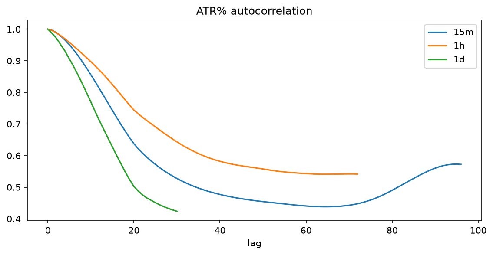

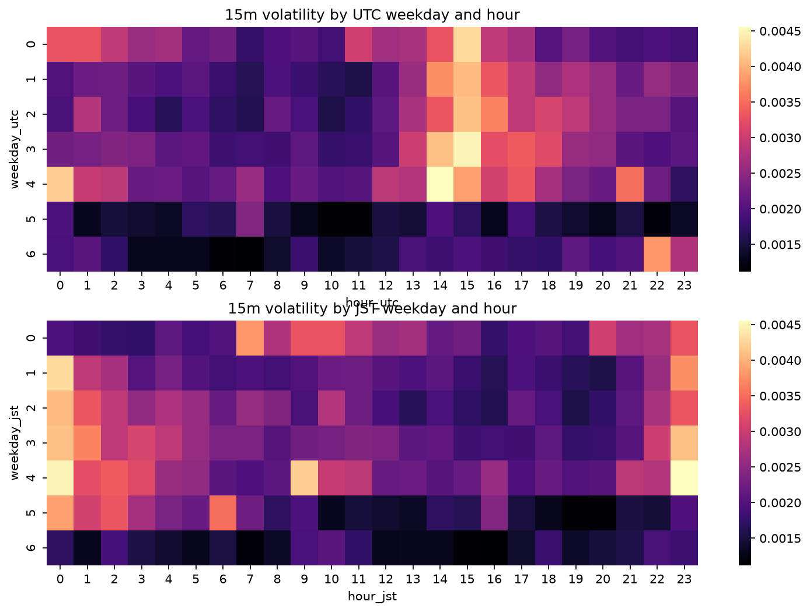

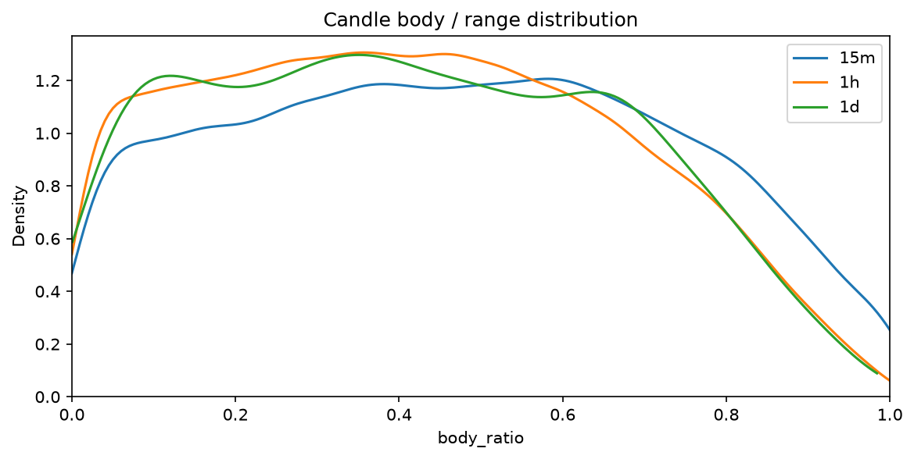

## 出来高・マルチタイムフレーム・リスク

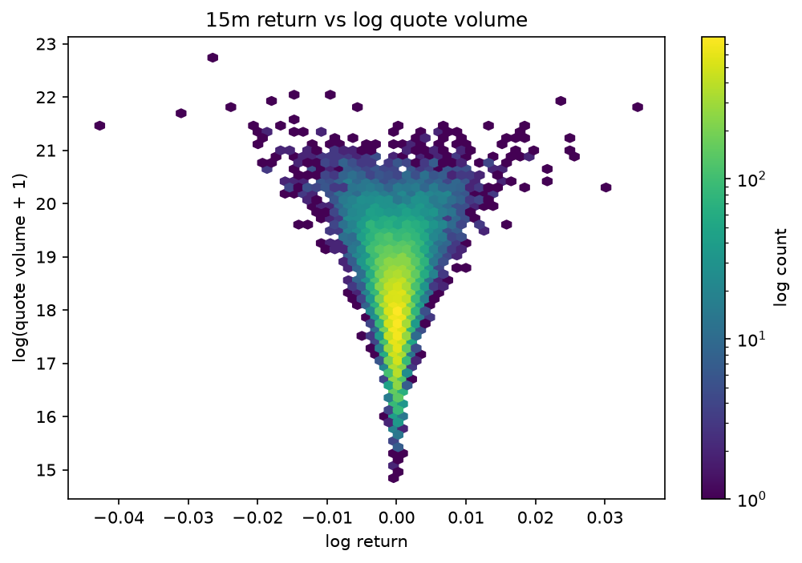

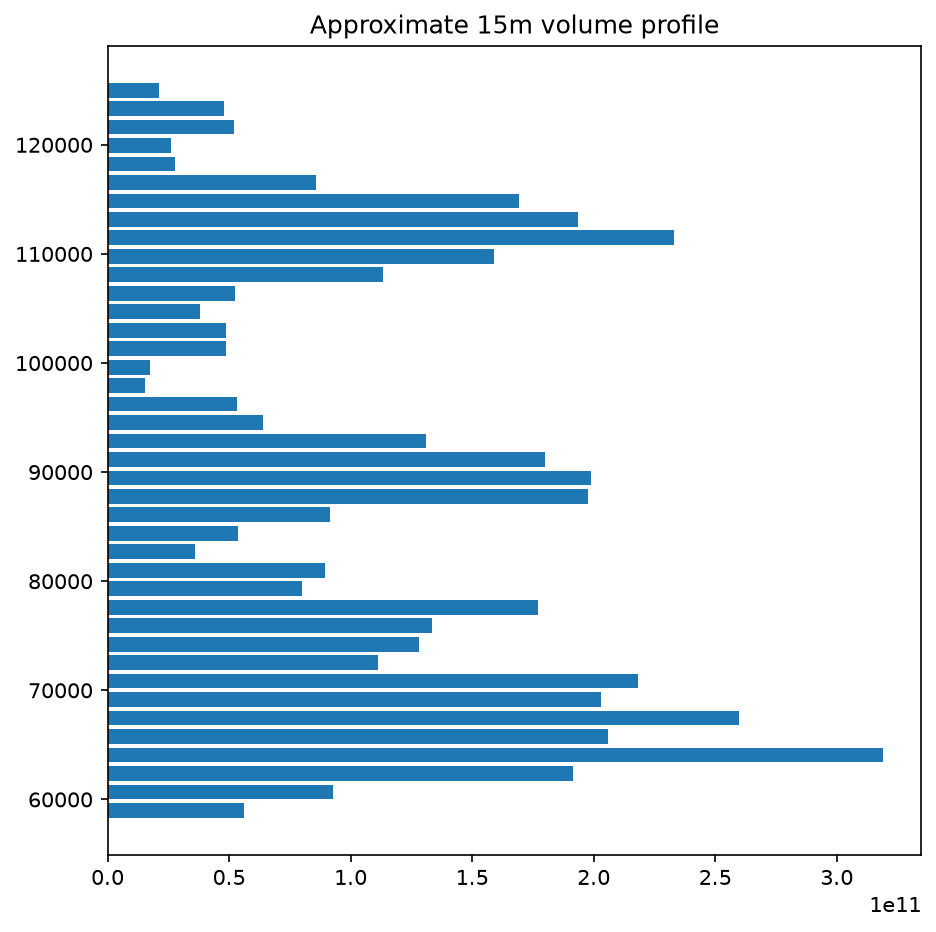

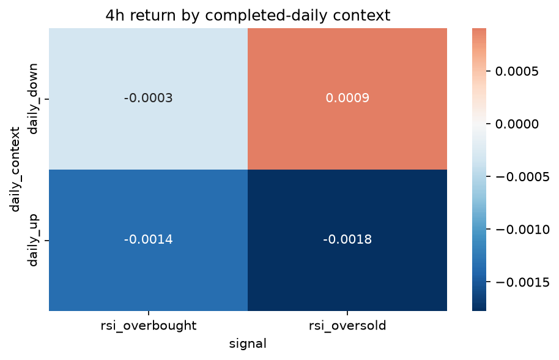

日足の特徴量は、各15分足に対して完了済みの日足のみをas-of結合しています。従って、当日未確定の日足終値は下位足判定へ流入しません。

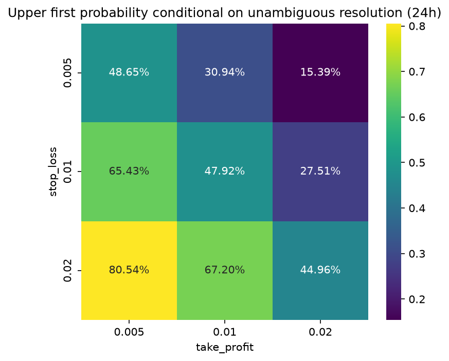

`upper_probability_given_resolution` は、同一足で両バリアに触れた曖昧ケースとタイムアウトを除いた条件付き確率です。

| take_profit | stop_loss | upper_first | lower_first | ambiguous_same_bar | timeout | resolved_count | upper_probability_given_resolution | upper_ci95_low | upper_ci95_high | status |
| --- | --- | --- | --- | --- | --- | --- | --- | --- | --- | --- |
| 0.005 | 0.005 | 4165 | 4396 | 39 | 136 | 8561 | 0.486509 | 0.465293 | 0.504459 | ok |
| 0.005 | 0.01 | 5488 | 2900 | 9 | 339 | 8388 | 0.654268 | 0.62993 | 0.677515 | ok |
| 0.005 | 0.02 | 6386 | 1543 | 0 | 807 | 7929 | 0.805398 | 0.784077 | 0.826592 | ok |
| 0.01 | 0.005 | 2578 | 5753 | 15 | 390 | 8331 | 0.309447 | 0.282136 | 0.332742 | ok |
| 0.01 | 0.01 | 3753 | 4078 | 2 | 903 | 7831 | 0.479249 | 0.44705 | 0.510117 | ok |
| 0.01 | 0.02 | 4603 | 2247 | 0 | 1886 | 6850 | 0.671971 | 0.637774 | 0.701558 | ok |
| 0.02 | 0.005 | 1196 | 6575 | 2 | 963 | 7771 | 0.153906 | 0.133358 | 0.176052 | ok |
| 0.02 | 0.01 | 1836 | 4839 | 0 | 2061 | 6675 | 0.275056 | 0.241603 | 0.308494 | ok |
| 0.02 | 0.02 | 2253 | 2758 | 0 | 3725 | 5011 | 0.449611 | 0.405752 | 0.504784 | ok |

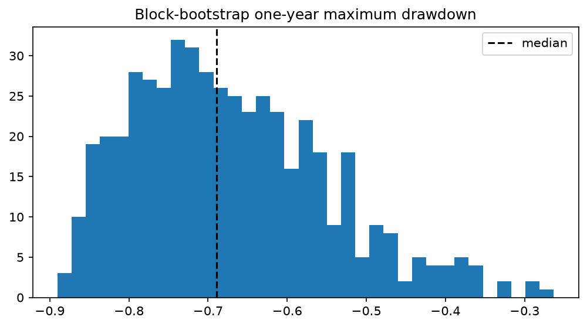

SMA20/50の単純戦略をブロック・ブートストラップしたMDD推定では、中央値 -68.91%、5%分位 -84.22%、資産半減確率 82.20% です。

## Funding・OI・清算代理指標

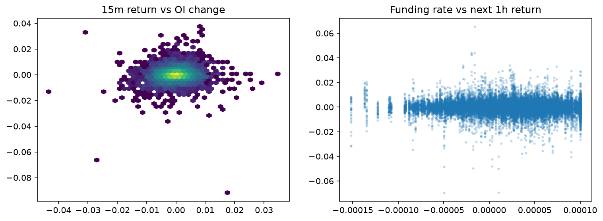

| event | count | mean_forward_1h | median_forward_1h | positive_rate | mean_ci95_low | mean_ci95_high | status |
| --- | --- | --- | --- | --- | --- | --- | --- |
| all | 35036 | -7.12094e-05 | 0 | 0.499943 | -0.000174216 | 1.90367e-05 | ok |
| sharp_drop | 1052 | 0.000259955 | 0.000497362 | 0.539924 | -0.000191955 | 0.000771974 | ok |
| oi_drop | 3504 | -3.99649e-05 | 3.89201e-05 | 0.508276 | -0.000277787 | 0.000217631 | ok |
| funding_top_decile | 3360 | -0.000317534 | -9.03665e-05 | 0.485714 | -0.000566839 | -1.81181e-05 | ok |
| top_trader_long_ratio_top_decile | 3504 | -9.16792e-05 | 0.000180209 | 0.523687 | -0.000507032 | 0.00031176 | ok |
| global_long_ratio_top_decile | 3504 | -0.000186958 | 0.000164851 | 0.521975 | -0.000598703 | 0.000141892 | ok |
| global_long_ratio_bottom_decile | 3504 | -1.12688e-05 | -4.46248e-05 | 0.49258 | -0.000203011 | 0.000198378 | ok |
| taker_buy_ratio_top_decile | 3502 | 0.000650628 | 0.000511536 | 0.598515 | 0.000492692 | 0.000803706 | ok |
| taker_buy_ratio_bottom_decile | 3504 | -0.000728338 | -0.000487263 | 0.410959 | -0.000920927 | -0.000580759 | ok |
| liquidation_proxy | 161 | 0.000495625 | 0.000333851 | 0.534161 | -0.000507333 | 0.00240458 | ok |

## HMM / GMM / 変化点

| states | hmm_holdout_loglik_per_row | hmm_min_occupancy | hmm_converged | hmm_full_min_occupancy | gmm_bic | gmm_min_occupancy | gmm_converged | gmm_seed_mean_ari |
| --- | --- | --- | --- | --- | --- | --- | --- | --- |
| 3 | -8.98851 | 0.0502461 | True | 0.193089 | 1.12331e+06 | 0.214312 | True | 0.718219 |
| 4 | -8.48026 | 0.0315117 | True | 0.120426 | 1.07296e+06 | 0.136796 | True | 0.997323 |

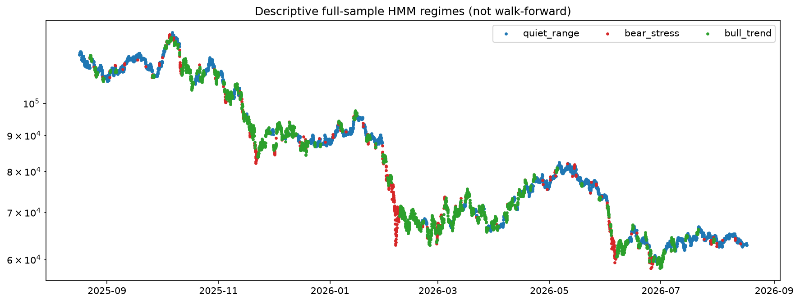

| model | state | count | occupancy | mean_hourly_return | mean_rv_24 | mean_momentum_168 | next_1h_return | next_1h_ci95_low | next_1h_ci95_high | next_24h_return | next_24h_vol |
| --- | --- | --- | --- | --- | --- | --- | --- | --- | --- | --- | --- |
| HMM | bear_stress | 11182 | 0.193089 | -9.99728e-05 | 0.0508007 | -0.0141213 | 8.13222e-05 | -0.000104228 | 0.000297303 | 0.00229055 | 0.0438339 |
| HMM | bull_trend | 26124 | 0.451106 | 9.60571e-05 | 0.0263818 | 0.0159724 | 1.99642e-05 | -4.43184e-05 | 8.88417e-05 | 0.00033631 | 0.0267261 |
| HMM | quiet_range | 20605 | 0.355805 | 3.16109e-05 | 0.0137142 | 0.00495284 | 2.78887e-05 | -1.77068e-05 | 7.60493e-05 | 0.000699738 | 0.0170163 |
| GMM | bear_stress | 7922 | 0.136796 | -0.000507015 | 0.053002 | -0.0440212 | 0.000118155 | -0.00010161 | 0.000327958 | 0.00151231 | 0.0457312 |
| GMM | bull_trend | 14803 | 0.255616 | 0.000410943 | 0.0287014 | 0.0659017 | 6.14061e-05 | -4.38268e-05 | 0.000173361 | 0.00143973 | 0.0285207 |
| GMM | quiet_range | 15925 | 0.274991 | 0.00012409 | 0.0158295 | 0.0363314 | 3.7885e-05 | -2.01047e-05 | 0.000111206 | 0.00107562 | 0.0182903 |
| GMM | volatile_transition | 19261 | 0.332597 | -0.000103831 | 0.0229997 | -0.0438177 | -2.29921e-05 | -9.06883e-05 | 5.43674e-05 | -8.43236e-05 | 0.0240583 |

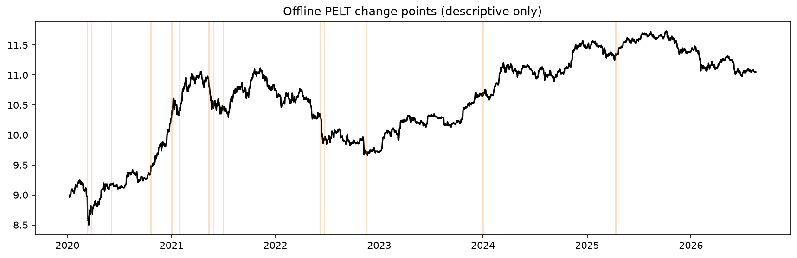

全標本HMM/GMMおよびPELTは将来分布を含む説明用です。`bull_trend` / `bear_stress` の符号条件を満たさない状態は `momentum_proxy` / `stress_proxy` と明記しており、任意の経済的ラベルを後付けしていません。

## Walk-forward（売買シグナルではなく検証用）

初期窓でHMM/GMMの状態数を選び、以後は月初ごとに過去730日（欠損なしの暦スパンかつ有効行99%以上）だけで再学習しました。HMMの本番ラベルは逐次forward filter、GMMは当時点特徴量の `predict_proba` を用いています。月次のViterbi ARIは「追加学習を含む再fit後の状態分割」の安定性指標であって、オンライン推論の精度ではありません。

| model | regime | count | label_count | occupancy | mean_probability | next_1h_return | next_1h_ci95_low | next_1h_ci95_high | next_24h_return | next_24h_return_ci95_low | next_24h_return_ci95_high | next_24h_vol | next_24h_vol_ci95_low | next_24h_vol_ci95_high | next_24h_mae | next_24h_mae_ci95_low | next_24h_mae_ci95_high | next_24h_mfe | next_24h_mfe_ci95_low | next_24h_mfe_ci95_high | status |
| --- | --- | --- | --- | --- | --- | --- | --- | --- | --- | --- | --- | --- | --- | --- | --- | --- | --- | --- | --- | --- | --- |
| HMM | bear_stress | 3355 | 3355 | 0.0843155 | 0.961694 | -3.76315e-05 | -0.000319799 | 0.000234448 | -0.000795989 | -0.00495962 | 0.00392077 | 0.0352644 | 0.0325211 | 0.0382866 | -0.0305556 | -0.0345896 | -0.0265047 | 0.0282423 | 0.0255578 | 0.0313921 | ok |
| HMM | bull_trend | 7600 | 7600 | 0.190998 | 0.966269 | 7.52217e-05 | -2.21177e-05 | 0.000182731 | 0.00137623 | -0.000549447 | 0.00347801 | 0.022278 | 0.0212204 | 0.0232366 | -0.0177431 | -0.0192114 | -0.0164958 | 0.0195121 | 0.0179528 | 0.0213966 | ok |
| HMM | momentum_proxy | 936 | 936 | 0.0235229 | 0.96516 | 0.00019183 | -7.69512e-05 | 0.000452801 | 0.00639343 | 0.0019353 | 0.0115937 | 0.018109 | 0.0159175 | 0.0202001 | -0.011492 | -0.0137442 | -0.00929248 | 0.0219602 | 0.0164802 | 0.0287587 | ok |
| HMM | quiet_range | 13052 | 13052 | 0.328014 | 0.983082 | -3.25582e-05 | -8.95563e-05 | 2.25389e-05 | -0.000230214 | -0.00154439 | 0.000930806 | 0.0172026 | 0.0166034 | 0.0177909 | -0.0153093 | -0.0163793 | -0.0142443 | 0.0149502 | 0.0139735 | 0.0158048 | ok |
| HMM | stress_proxy | 2487 | 2487 | 0.0625016 | 0.966719 | 0.000183354 | -8.16875e-05 | 0.000444272 | 0.00387447 | 4.53444e-05 | 0.0076048 | 0.030965 | 0.0288344 | 0.0333172 | -0.0251807 | -0.0286583 | -0.0220293 | 0.0260749 | 0.0233597 | 0.0289134 | ok |
| HMM | volatile_transition | 12361 | 12361 | 0.310648 | 0.966724 | -1.35e-05 | -0.000106397 | 9.55777e-05 | -0.000694874 | -0.00228209 | 0.00104668 | 0.02428 | 0.0235722 | 0.0251127 | -0.0212973 | -0.0226244 | -0.0200076 | 0.0200158 | 0.018795 | 0.0213294 | ok |
| GMM | bear_stress | 5855 | 5855 | 0.147144 | 0.938459 | -7.61501e-07 | -0.000207165 | 0.000199877 | -0.00121927 | -0.0045468 | 0.00186348 | 0.0326576 | 0.030893 | 0.0346185 | -0.0293879 | -0.032535 | -0.0265181 | 0.0252473 | 0.0229856 | 0.0275614 | ok |
| GMM | bull_trend | 9184 | 9184 | 0.230806 | 0.929119 | 9.49012e-05 | -1.75191e-05 | 0.000193172 | 0.00196697 | 0.00018992 | 0.0035717 | 0.0231545 | 0.0222857 | 0.0240736 | -0.018658 | -0.0198828 | -0.0175748 | 0.0212302 | 0.0196941 | 0.022759 | ok |
| GMM | quiet_range | 11397 | 11397 | 0.286422 | 0.909035 | 1.29409e-07 | -6.17844e-05 | 7.01396e-05 | -8.71789e-05 | -0.00144357 | 0.0012601 | 0.0181816 | 0.0175029 | 0.0189265 | -0.0155431 | -0.0166319 | -0.0145256 | 0.0159233 | 0.01486 | 0.0170535 | ok |
| GMM | volatile_transition | 13355 | 13355 | 0.335629 | 0.928444 | -2.84109e-05 | -0.000111438 | 5.38875e-05 | 0.000138831 | -0.00140875 | 0.00192873 | 0.0221009 | 0.021293 | 0.0228769 | -0.018965 | -0.0200723 | -0.0175441 | 0.0184718 | 0.0173143 | 0.0197253 | ok |

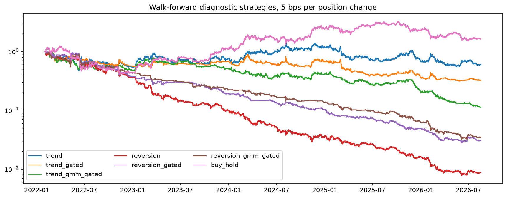

| strategy | fee_bps | total_return | annualized_return | annualized_volatility | sharpe | max_drawdown |
| --- | --- | --- | --- | --- | --- | --- |
| trend | 0 | -0.116372 | -0.0268693 | 0.501441 | -0.0543171 | -0.569215 |
| trend | 5 | -0.40263 | -0.107229 | 0.501563 | -0.226144 | -0.633276 |
| trend | 10 | -0.596153 | -0.180954 | 0.501855 | -0.397753 | -0.687811 |
| trend_gated | 0 | -0.209918 | -0.0505491 | 0.354492 | -0.146326 | -0.444271 |
| trend_gated | 5 | -0.676035 | -0.219746 | 0.354636 | -0.699691 | -0.691 |
| trend_gated | 10 | -0.867161 | -0.358791 | 0.355081 | -1.25155 | -0.870403 |
| trend_gmm_gated | 0 | -0.23525 | -0.0573363 | 0.386383 | -0.152817 | -0.530873 |
| trend_gmm_gated | 5 | -0.886756 | -0.380927 | 0.386577 | -1.24046 | -0.888592 |
| trend_gmm_gated | 10 | -0.983231 | -0.593438 | 0.387333 | -2.32363 | -0.983494 |
| reversion | 0 | -0.203029 | -0.0487327 | 0.501441 | -0.0996332 | -0.616849 |
| reversion | 5 | -0.991283 | -0.647973 | 0.502109 | -2.07933 | -0.992366 |
| reversion | 10 | -0.999905 | -0.869729 | 0.504526 | -4.03971 | -0.999907 |
| reversion_gated | 0 | -0.301051 | -0.0758242 | 0.3427 | -0.230093 | -0.572536 |
| reversion_gated | 5 | -0.96952 | -0.53628 | 0.343328 | -2.23831 | -0.972514 |
| reversion_gated | 10 | -0.998671 | -0.767321 | 0.34553 | -4.21988 | -0.998673 |
| reversion_gmm_gated | 0 | -0.126462 | -0.0293266 | 0.344657 | -0.086362 | -0.470334 |

先頭 16 行を表示。全行は対応するCSVを参照。

## 再現手順

```powershell
cd C:/Users/Hodaka/Downloads/div/bot_research/binance-btcusdt-futures-research
.\.venv\Scripts\python.exe -m pip install -r requirements.lock
.\.venv\Scripts\python.exe -m pip install -e . --no-deps
.\.venv\Scripts\python.exe download_binance_klines.py --end-date 2026-08-17
.\.venv\Scripts\python.exe collect_research_inputs.py --config configs/research.json
.\.venv\Scripts\python.exe run_research.py --config configs/research.json --stage all
.\.venv\Scripts\python.exe run_research.py --config configs/research.json --stage verify
.\.venv\Scripts\python.exe run_research.py --config configs/research.json --stage reproduce-check
.\.venv\Scripts\python.exe run_research.py --config configs/research.json --stage report
.\.venv\Scripts\python.exe run_research.py --config configs/research.json --stage verify
```

`results/manifest.json` は入力アーカイブ、正規化CSV、設定、成果物のSHA-256を保持します。GPUはこの規模では優位性がないため使わず、月次再学習はCPU 4ワーカー・ライブラリ内部1スレッドに制限しています。
